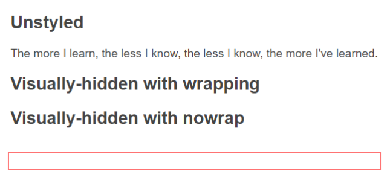

_in progress_

# Из чего состоит visually-hidden

`visually-hidden` это популярный класс, который используется для скрытия элементов от пользователей, но оставляет их доступными для программ, например скринридеров(программ чтения экрана).

```html
<h2 class="visually-hidden">Этот текст визуально скрыт, но доступен для программ</h2>
<button type="button">
  <span content="visually-hidden">Этот текст визуально скрыт, но доступен для программ</span>
</button>
```

## За пределами видимости
Когда нам нужно скрыть элемент мы обычно имеем в виду, визуальное скрытие от глаз. Хотя уже можно смело заявить, что экран это не единственный способ вывода HTML-страниц. Люди повседневно используют скринридеры, а также другие устройства и программы, которые полагаются на [дерево доступности](https://developer.mozilla.org/en-US/docs/Glossary/Accessibility_tree), например [дисплей Брайля](https://ru.wikipedia.org/wiki/%D0%91%D1%80%D0%B0%D0%B9%D0%BB%D0%B5%D0%B2%D1%81%D0%BA%D0%B8%D0%B9_%D0%B4%D0%B8%D1%81%D0%BF%D0%BB%D0%B5%D0%B9).

На самом деле в разной ситуации нам нужно скрыть контент по-разному. 

### Типы скрытия
Есть несколько типов скрытия контента:

- **Полностью скрыт**

Элемент не отображается на экране, не раскрывается в дереве доступности, не доступен для клавиатурной навигации.

- **Семантически скрыт**

Элемент отображается на экране, но не раскрывается в дереве доступности, и все еще доступен для клавиатурной навигации.

- **Визуально скрыт**

Элемент не отображается на экране, но раскрывается в дереве доступности, и все еще доступен для клавиатурной навигации.

## Анатомия класса visually-hidden

Есть несколько вариантов CSS для `visually-hidden`, но вот один из самых популярных. Он покрывает большинство случаев, чем другие варианты, и обеспечивает надежное визуальное скрытие элементов от пользователей для большинства программ.

> Если вы знаете другие варианты CSS для `visually-hidden`, пожалуйста, сообщите мне, и я добавлю их сюда.

Каждое CSS-свойство имеет большую историю и причину попадания в `visually-hidden`. Некоторые свойства покрывают лишь редкие кейсы для редких программ.

```css
.visually-hidden:not(:focus):not(:active) {
  position: absolute;
  width: 1px;
  height: 1px;
  clip-path: inset(50%);
  overflow: hidden;
  white-space: nowrap;
}
```

### `position`
Удаляет элемент из потока документа, так что он не занимает места в макете. `top` и `left` не задаются; по умолчанию они имеют значение auto, что означает, что начальная позиция элемента в макете не меняется. И это очень важно.

Изначально для визуального скрытия использовалось "позиционирование слева", при котором элемент смещался за пределы области просмотра с помощью параметра `left:-100em` или подобного. Однако у этого подхода есть несколько проблем:

- Это приводит к появлению горизонтальных полос прокрутки на страницах RTL (справа налево).
- Вспомогательное программное обеспечение, которое программно прокручивает содержимое в поле зрения, может работать некорректно, если оно пытается показать содержимое, находящееся за пределами поля зрения. Это может повлиять на программное обеспечение для увеличения экрана, используемое некоторыми людьми со слабым зрением или трудностями чтения.
- Программы чтения с экрана не могут показывать визуальную индикацию положения курсора чтения, потому что курсор чтения находится за пределами области просмотра. В JAWS эта функция известна как визуальное отслеживание, и она рисует красную границу вокруг элемента, который читается (независимо от того, фокусируется он или нет; это не то же самое, что индикация фокуса).
Удерживание элемента в одном положении позволяет избежать всех этих проблем.

### `width` и `height` и `overflow`
Поскольку мы не можем переместить элемент, мы визуально скрываем его содержимое, уменьшая размер и переполнение:
Эти `1px` имеют большое значение. Мы не можем установить нулевые размеры для элемента с `overflow:hidden`, потому что это может привести к его удалению из дерева доступности.

> 02.2023. Все **современные** браузеры и программы чтения с экрана продолжают сохранять содержимое в дереве доступности, даже если оно имеет нулевые размеры. 

> 07.2023. Safari не фокусирует элементы с нулевыми размерами. Пропущенные ссылки с нулевой шириной или высотой не будут доступны пользователям Safari с клавиатуры. Поэтому размеры в 1px по-прежнему необходимы и останутся необходимыми в обозримом будущем. [Статья](https://www.matuzo.at/blog/2023/zero-width-height-skip/)

### `clip` и `clip-path`
При изменении размера и переполнении сохраняется один пиксель, который может быть виден. Если у элемента, например, зеленый фон, вы все равно получите один зеленый пиксель. От этого можно избавиться с помощью `clip` и/или `clip-path`:

```css
  clip: rect(0 0 0 0);
  clip-path: inset(50%);
```

Обратите внимание, что `clip` здесь фактически избыточен, поскольку определение `clip-path` приводит к тому же результату. `Clip` - это наследие, оставшееся с тех времен, когда `clip-path` еще не существовало. Но теперь, когда он существует и широко поддерживается (а clip в любом случае устарел), нет необходимости включать его, если вам не нужна поддержка Internet Explorer (IE).

### `white-space`
#### NVDA
Помогает с обработкой текста в NVDA. Обертывание в таком маленьком пространстве означает, что каждое слово находится на отдельной строке, и это может заставить NVDA переосмыслить пробелы как переносы строк, удалить их и тем самым превратить весь текст в одно слово.

> Проблема на данный момент сложно воспроизводится, но она была в прошлом и скорее всего касалась очень старых версий NVDA. [Статья](https://medium.com/@jessebeach/beware-smushed-off-screen-accessible-text-5952a4c2cbfe)

#### JAWS
Обёртывание текста влияет на размер индикатора визуального отслеживания в JAWS. 



### `:not(:focus):not(:active)`
Визуально скрытое содержимое не должно иметь фокуса клавиатуры, иначе зрячие пользователи клавиатуры могут нажать TAB на элемент, который они не видят.

> 12.2022. Cелектор также включает отрицание `:active`. В первоначальной версии этого поста она не была включена, поскольку с точки зрения логики в ней не должно быть необходимости - элемент с этими стилями не может находиться в состоянии `:active`, если он уже не находится в состоянии `:focus`. Safari не следует ожидаемой схеме взаимодействия. Если элемент имеет фокус клавиатуры, а затем на него нажимают указателем, событие "указатель вниз" приводит к потере состояния `:focus` в Safari, что означает, что ссылка на пропуск исчезнет до того, как она будет активирована. [Статья](https://mehdi.cc/).

## Варианты использования visually-hidden
### Название классов
- `visually-hidden`
- `sr-only`

### Селекторы
- Простой селектор: `.visually-hidden`
- Подробный селектор: `.visually-hidden:not(:focus):not(:active)` означает что элемент не будет виден, пока он не в фокусе или не активен.

### Тело
```css
.visually-hidden {
  position: absolute;
  width: 1px;
  height: 1px;
  margin: -1px;
  border: 0;
  padding: 0;
  white-space: nowrap;
  clip-path: inset(100%);
  clip: rect(0 0 0 0);
  overflow: hidden;
}
```

```css
.visually-hidden {
  clip: rect(0 0 0 0);
  clip-path: inset(50%);
  height: 1px;
  overflow: hidden;
  position: absolute;
  white-space: nowrap;
  width: 1px;
}
```

```css
.visually-hidden {
  border: 0 !important;
  clip: rect(1px, 1px, 1px, 1px) !important;
  -webkit-clip-path: inset(50%) !important;
  clip-path: inset(50%) !important;
  height: 1px !important;
  overflow: hidden !important;
  margin: -1px !important;
  padding: 0 !important;
  position: absolute !important;
  width: 1px !important;
  white-space: nowrap !important;
}
```

## Другие, абсолютно не рабочие, способы скрытия элементов

## Источники
- [Hiding DOM elements](https://allyjs.io/tutorials/hiding-elements.html)
- [TPGI: The anatomy of visually hidden](https://www.tpgi.com/the-anatomy-of-visually-hidden/)
- [The Web Needs a Native .visually-hidden, by Ben Myers](https://benmyers.dev/blog/native-visually-hidden/)
- [WebAim: Invisible Content](https://webaim.org/techniques/css/invisiblecontent/)
- [How Visible vs. Hidden Elements Affect Keyboard/Screen Reader Users, by Marcy Sutton](https://egghead.io/lessons/screen-reader-how-visible-vs-hidden-elements-affect-keyboard-screen-reader-users)
- [Hiding Content for Accessibility, by Jonathan Snook](https://snook.ca/archives/html_and_css/hiding-content-for-accessibility)
- [The State of Hidden Content Support in 2016](https://www.tpgi.com/the-state-of-hidden-content-support-in-2016/)
- [Hidden Content Tests, by Terrill Thompson](https://terrillthompson.com/tests/hiddencontent.html)
- [Explanation of white-space: nowrap, in visually-hidden class](https://medium.com/@jessebeach/beware-smushed-off-screen-accessible-text-5952a4c2cbfe)
